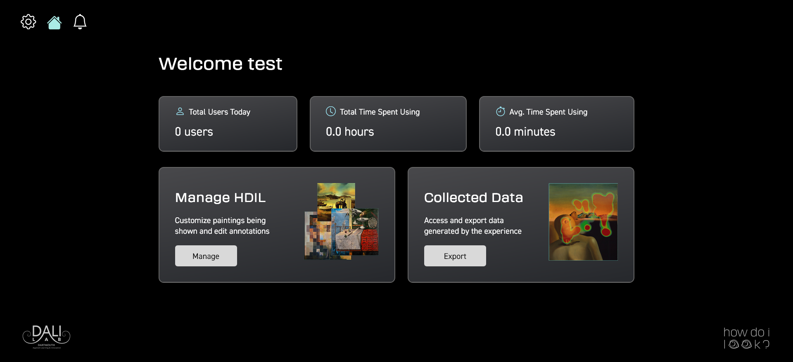
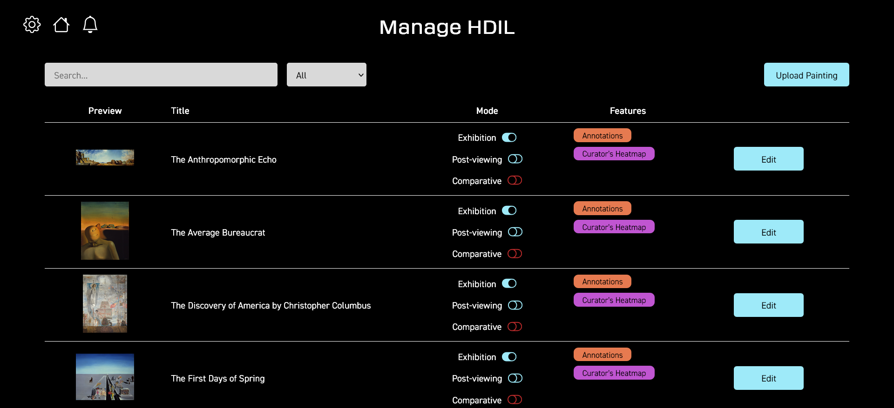
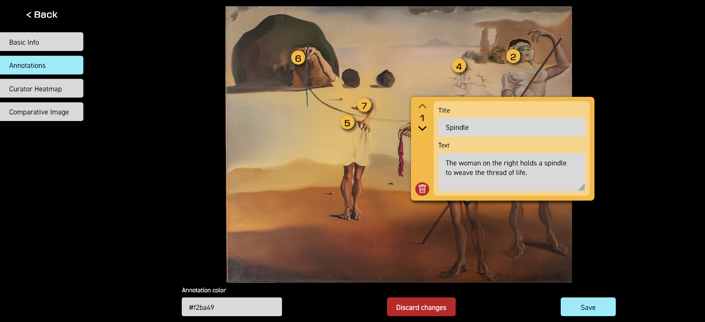
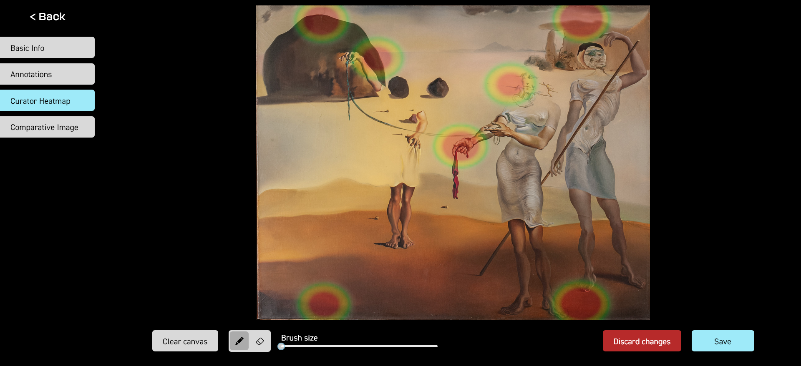

# Dali Museum Admin Dashboard

## Designs

[Link to the project Figma](https://www.figma.com/design/7l2FM6Y7hF9YlxZY2JjmH1/Dali-Museum-25W)

## Architecture

### Tech Stack

- [React v18](https://reactjs.org/)
- [React Query](https://tanstack.com/query/v4/docs/framework/react/overview)
- [axios](https://github.com/axios/axios)
- [React Router v6](https://reactrouter.com/en/main)
- [TypeScript](https://www.typescriptlang.org/docs/)
- [Vite](https://vitejs.dev/)

### File Structure

    .
    ├── ...
    ├── public
    ├── src
    │   └── api                # React Query server state cache
    │   └── assets             # static assets
    │   └── components         # reusable components across several screens
    │   └── hooks              # custom react hooks
    │   └── screens            # individual pages
    │   └── types              # TS types
    │   └── utils              # utility folder containing helper files
    ├── tsconfig.json          # TypeScript configuration
    ├── package.json           # npm config
    └── ...

For more detailed documentation on our file structure and specific functions in
the code, feel free to check the project files themselves.

## Available Scripts

In the project directory, you can run:

### `npm install`

Installs project dependencies.

### `npm run start`

Runs the app in the development mode. Open
[http://localhost:5173](http://localhost:5173) to view it in the browser.

The page will reload if you make edits. You will also see any lint errors in the
console.

### `npm run build`

Builds the app for production to the `build` folder. It correctly bundles React
in production mode and optimizes the build for the best performance.

The build is minified and the filenames include the hashes. Your app is ready to
be deployed!

### `npm run lint`

ESLint is set up in this project. To keep code clean, always remember to run
`npm run lint` and fix any lint problems before merging into master.

## Deployment

[Link](https://dali-museum-admin-dashboard.brunchlabs.com/dashboard)

The app automatically redeploys whenever new commits are pushed to the main
branch.

## Authors

- Eljo Kondi ’25, Product Manager
- Ramina Askarova ’26, Design Mentor
- Yvonne Chen ’25, Designer
- Miruna Palaghean ’25 Developer Mentor
- Lydia Jin ’26 Developer
- Rishav Chakravarty ’25 Developer
- Annie Tang ’25 Product Manager
- Tanner Hume ’28 Developer
- Jack Bolitho ’27 Developer
- Jacob Bacus ’27 Developer
- Helen Cui ’27 Product Manager

## Acknowledgments

We would like to thank Beth Harrison, Jack Jakober, Pape Sow Traore, Tim
Tregubov, Madison Dunaway for their support, guidance, and opportunity.

---

Designed and developed by [@DALI Lab](https://github.com/dali-lab)

### Template

- Eric Lu '25

Additional credit goes to Adam McQuilkin '22, Thomas Monfre '21, Tyler Vergho
'23 for developing the original DALI
[CRUD Template Frontend](https://github.com/dali-lab/crud-template-frontend),
which this starter pack was evolved from.
